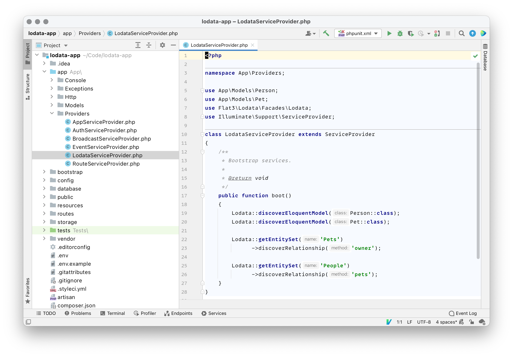

<h2>Supercharge your APIs</h2>

Develop single page and mobile applications with OData-supporting UI frameworks.

<h2>Get big data</h2>

Make live connections to business intelligence tools including PowerBI, Tableau and Excel.

<h2>Commercial support</h2>

<a href="https://flat3.co">Flat3</a> provides commercial support for Lodata. If you need help integrating Lodata into your application, want to build
  a Lodata-powered service or need new features then <a href="https://flat3.co">get in touch</a>.

<h2>Powerful IDE support &rarr;</h2>

Lodata is strongly typed throughout and contains docblocks on every function.

IDEs including [PhpStorm](https://www.jetbrains.com/phpstorm/) and
[Visual Studio Code](https://code.visualstudio.com/docs/languages/php)
can pick up this documentation and provide autocompletion to guide you through configuring your model.

<h2>&larr; Discoverable APIs</h2>

OData RESTful APIs are easy to consume. The OData metadata, a machine-readable description of the data model of the APIs,
enables the creation of powerful generic client proxies and tools.

The metadata is available as standard [OpenAPI v3](https://www.openapis.org)
which can be loaded into API collaboration platforms like Postman.

<h2>Simplify your workflow &rarr;</h2>

[Microsoft Excel 2019](https://www.microsoft.com/en-gb/microsoft-365/excel) supports live updating
[OData Feeds](https://docs.microsoft.com/en-us/power-query/connectors/odatafeed) using Power Query.

No more time-consuming downloading and importing of CSV and XLSX files for your reports, instead securely refresh your
data in a single click.

<h2>&larr; Discover insights</h2>

Easily connect to, model, and visualize your data in off-the-shelf business intelligence tools.

Microsoft [Power BI](https://powerbi.microsoft.com) supports OData as a first class data connector. Develop
reports locally, and then publish them to the [PowerBI Service](https://docs.microsoft.com/en-us/power-bi/fundamentals/power-bi-service-overview)
where they'll refresh themselves unattended, directly from your Lodata service.

