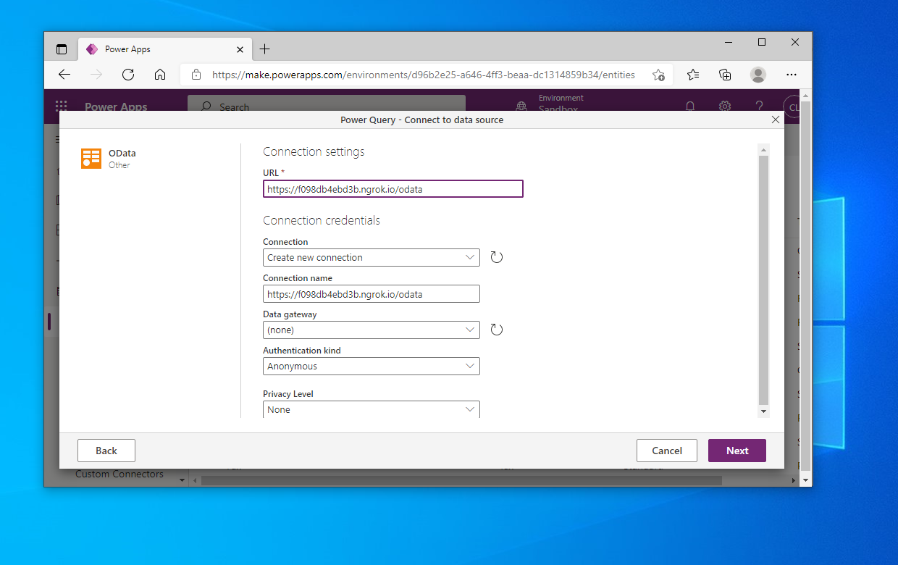
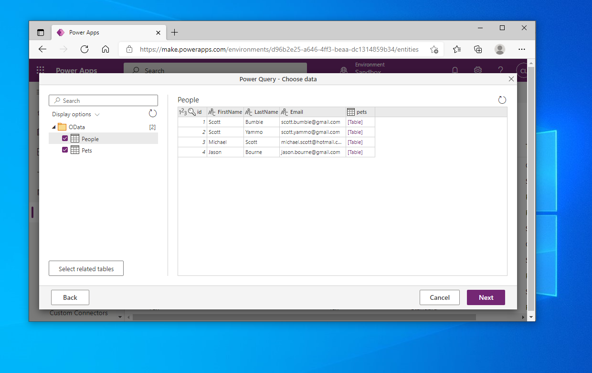
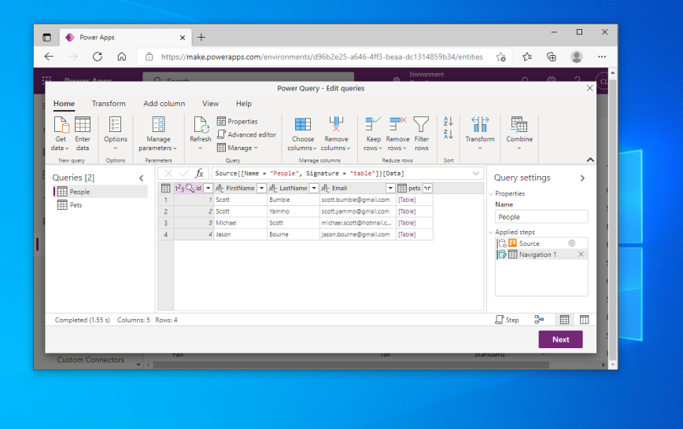
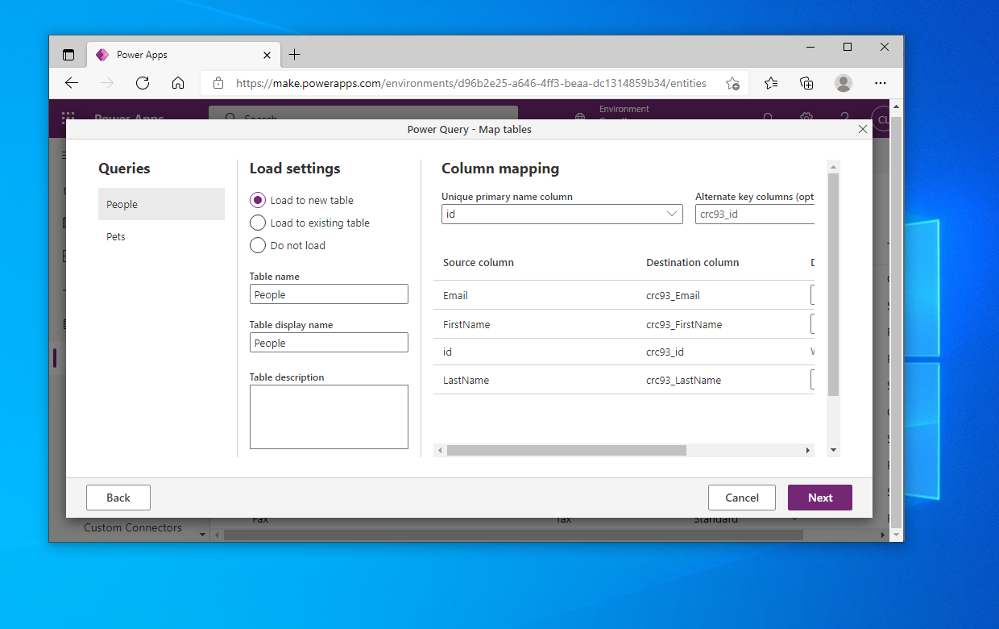
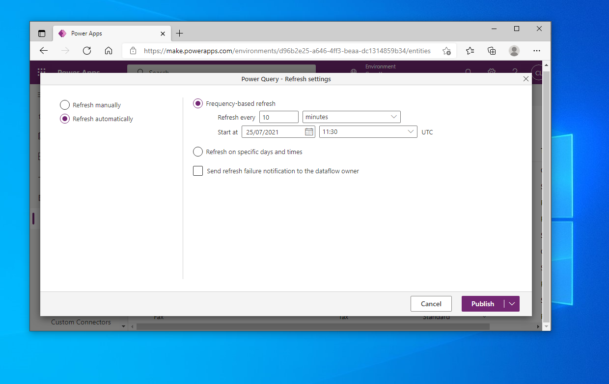

# Microsoft Dataverse

Microsoft [Dataverse](https://docs.microsoft.com/en-us/powerapps/maker/data-platform/) is a cloud data hub that many
other Microsoft services can use as a source for their data. This service was previously known as the Common
Data Service. By connecting Dataverse to Lodata, many other Microsoft Power Platform services can interact with your
data.

This includes [Power Apps](https://powerapps.microsoft.com), [Power Automate](https://flow.microsoft.com)
and [Power Virtual Agents](https://powervirtualagents.microsoft.com).

When directing your users to integrate your app with Dataverse they will need your 'OData Endpoint'.
This can be programmatically generated and presented by your app using:

```php
\Lodata::getEndpoint()
```

This guide describes adding data to a table using the same process as in the 
[Microsoft Dataverse by using Power Query](https://docs.microsoft.com/en-us/powerapps/maker/data-platform/add-data-power-query).
guide.

In this example we have used [ngrok](https://ngrok.com) to expose our local service to the Internet so it can be
accessed by the Microsoft cloud.

### Step 1 - Get Data in Power Apps

Open Power Apps, choose Data -> Tables from the left navigation, and then Data -> Get Data.


---

### Step 2 - Find OData

Use the search box to find the OData connector.


---

### Step 3 - Enter your connection settings.

The OData endpoint is required.



---

### Step 4 - Choose your data

Dataverse fetches the metadata document and describes the available tables for selection.



---

### Step 5 - Edit the query

At this stage you can modify the data that is available, such as the columns, and perform any post-import processing.



---

### Step 6 - Choose load settings

Determine whether to load into an existing table or create a new one.



---

### Step 7 - Set up refresh

Determine how often to refresh the data from the OData service. After clicking Publish your data will be loaded into
the Dataverse service.

