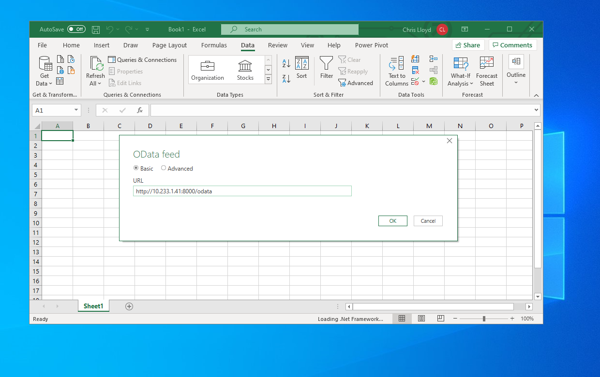
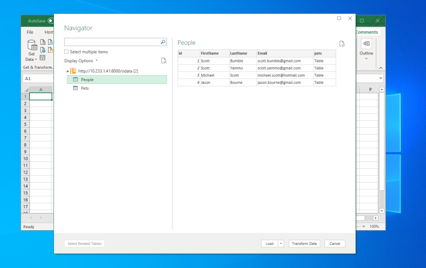
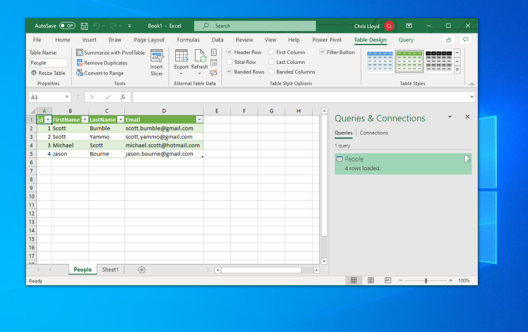

# Microsoft Excel

Microsoft [Excel 2019](https://www.microsoft.com/en-gb/microsoft-365/excel) (and some earlier versions) supports live updating
[OData Feeds](https://docs.microsoft.com/en-us/power-query/connectors/odatafeed) using Power Query.

## Importing manually

An OData entity set can be imported into Excel using the following steps. Once imported the model can be updated
by clicking the "Refresh" button on the toolbar. Excel understands OData types and will automatically type the columns
according to the schema. Excel can also recognise and import the relationships between models, and can create pivot
table automatically from this information.

### Step 1 - Get Data from OData Feed


---

### Step 2 - Supply the OData endpoint

At this stage if Lodata has authentication configured the user will be prompted for their credentials. Credentials
are not stored in the sheet. If the workbook is sent to another user they will be prompted to authenticate
when they open it.



---

### Step 3 - Choose the set

Excel parses the metadata document and identifies importable sets. Choosing the "Select multiple items" checkbox
will enable Excel to import several sets at once, and to automatically import any relationships that
exist between them.



---

### Step 4 - Load the data

When importing a single set the data can be loaded into a sheet. Now that the data connection has been established
the Refresh button can be used on the toolbar to reload the sets.



## Importing automatically

Lodata provides an easy way to add a "Connect to Excel" button in your application using an
[ODCFF](https://docs.microsoft.com/en-us/openspecs/office_file_formats/ms-odcff/09a237b3-a761-4847-a54c-eb665f5b0a6e)
document. This document contains the information needed to make the connection as described above.

The URL provided for this button will be for a specific entity set, for example if you have the `Users` entity set
defined: [`http://127.0.0.1:8000/odata/_lodata/Users.odc`](http://127.0.0.1:8000/odata/_lodata/Users.odc)

This URL can be programmatically generated:
```php
\Lodata::getOdcUrl('Users')
```
