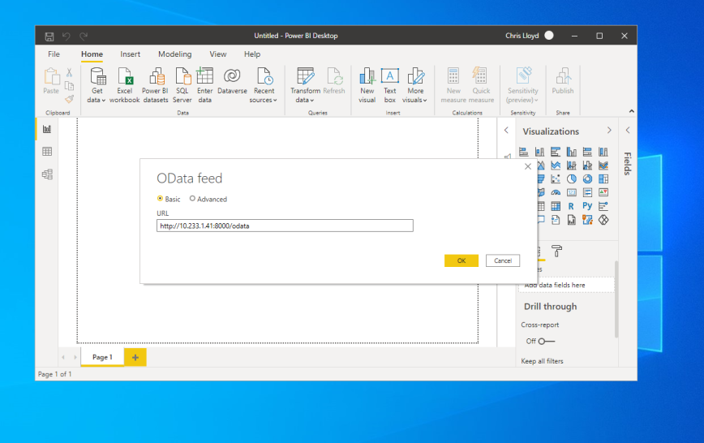
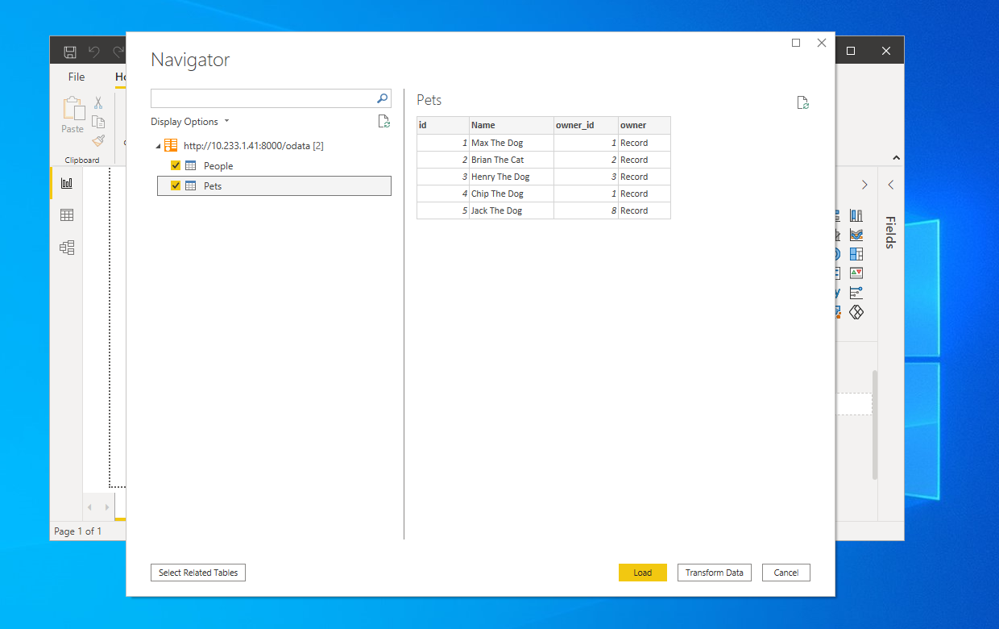
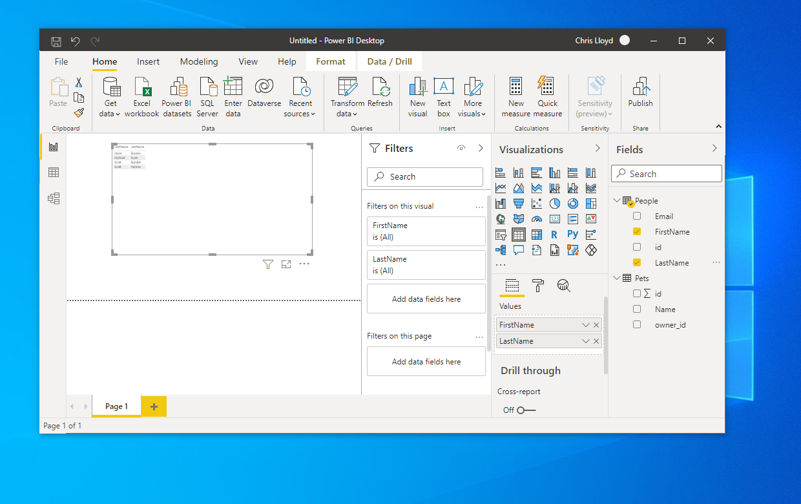

# Microsoft PowerBI

Microsoft [Power BI](https://powerbi.microsoft.com) supports creating connections to OData Feeds. Once your Power BI
report is created it can be published into the [PowerBI Service](https://docs.microsoft.com/en-us/power-bi/fundamentals/power-bi-service-overview)
where it can be configured to automatically refresh itself in the cloud.

## Connect manually

An OData model can be imported into Power BI using the following steps. Once imported the model can be updated
by clicking the "Refresh" button on the toolbar. Power BI understands OData types and will automatically type the columns
according to the schema. Power BI can also recognise and import the relationships between models.

### Step 1 - Get Data from OData Feed


---

### Step 2 - Supply the OData endpoint

At this stage if Lodata has authentication configured the user will be prompted for their credentials. Credentials
are not stored in the report. If the report is sent to another user they will be prompted to authenticate
when they open it.



---

### Step 3 - Choose the sets

Power BI parses the metadata document and identifies importable sets. Choosing the multiple items
will enable Power BI to import several sets at once, and to automatically import any relationships that
exist between them.



---

### Step 4 - Load the data

Once the data connection is made, you can use the data to build reports.




## Connect automatically

Microsoft [PowerBI](https://powerbi.microsoft.com) supports creating a live connection to an OData source via its
[PBIDS](https://docs.microsoft.com/en-us/power-bi/connect-data/desktop-data-sources#using-pbids-files-to-get-data)
document format.

The URL to the PBIDS document can be used in a "Connect to PowerBI" feature button. Unlike Excel which works on a single
entity set, this URL provides PowerBI with access to the whole model:
[`http://127.0.0.1:8000/odata/_lodata/odata.pbids`](http://127.0.0.1:8000/odata/_lodata/odata.pbids)

This URL can be programmatically generated:
```php
\Lodata::getPbidsUrl()
```