# Salesforce Connect

[Salesforce Connect](https://help.salesforce.com/articleView?id=sf.platform_connect_about.htm&type=5)
provides seamless integration of data across system boundaries by letting your users view,
search, and modify data that’s stored outside their Salesforce org.

Salesforce can interact with a Lodata service in real time, supporting data reads by searching and filtering, and
allowing the creation, updating and deletion of OData objects through the Lightning experience.

## External Data Source

### Step 1 - Setup

In Salesforce setup, navigate to Integrations -> External Data Sources and choose "New External Data Source".

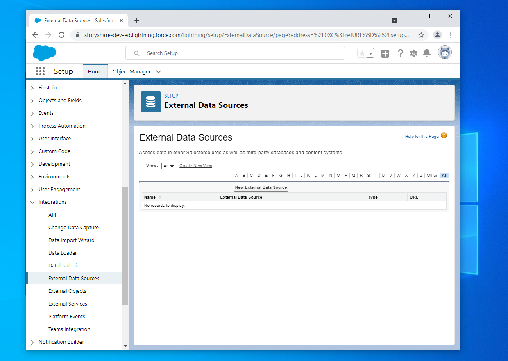

---

### Step 2 - Configure data source

Configure the data source with an appropriate name, and type "Salesforce Connect OData 4.0". The URL is the normal
endpoint that can be programmatically generated and presented by your app using:

```php
\Lodata::getEndpoint()
```

This example has all Lodata-supported features enabled, including "Writable External Objects",
"Server Driven Pagination" and "Use Free-Text Search Expressions". Choose "Save" to complete the configuration.

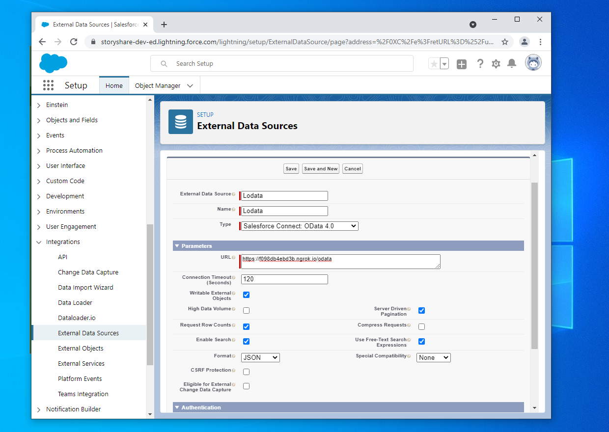

---

### Step 3 - Validate and Sync

Click the "Validate and Sync" button to get a list of available entity sets.

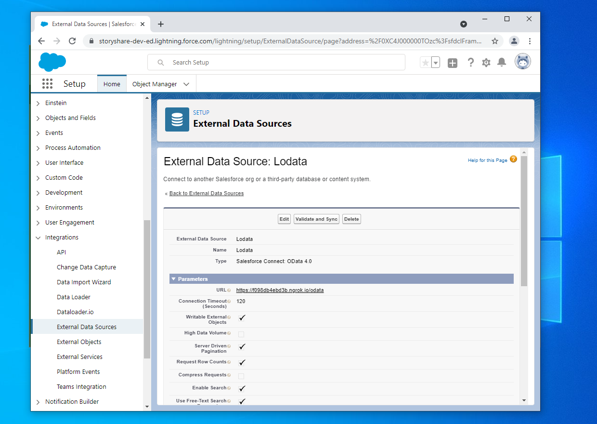

---

### Step 4 - Sync entity sets

Select the entity sets to make available as external data objects, and click "Sync".


---

### Step 5 - Edit the objects

At this stage we can edit the object definition to tidy it up. Click the name of the external object to see its settings.

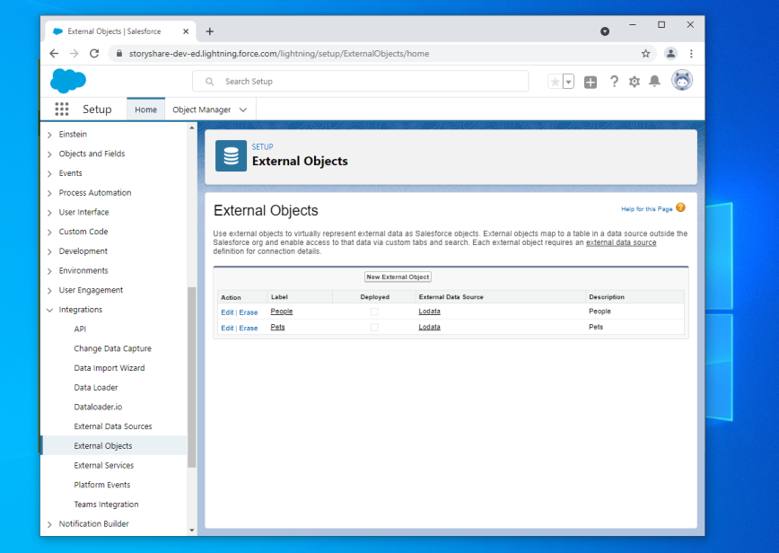

---

### Step 6 - Edit page layout

Salesforce has imported the complete list of properties on the object, which for some entity set types includes
the "ID" as a property. This should be removed for SQL-style sets that have a computed ID. Click the "Edit" action
under "Page Layouts".

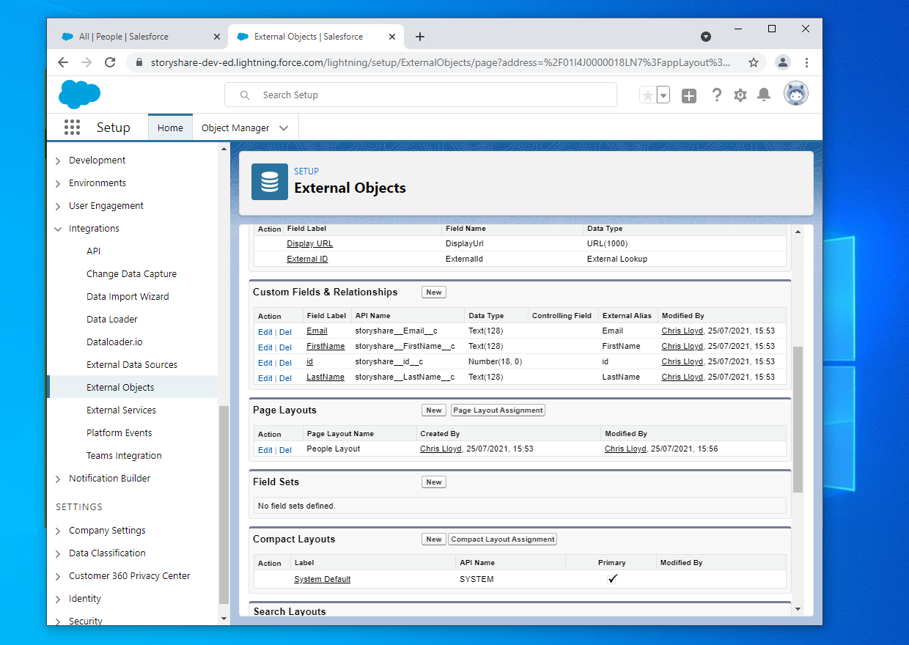

---

### Step 7 - Remove ID field

Scroll down to the "Detail" section for the set, and remove the "id" field. Save the page layout.

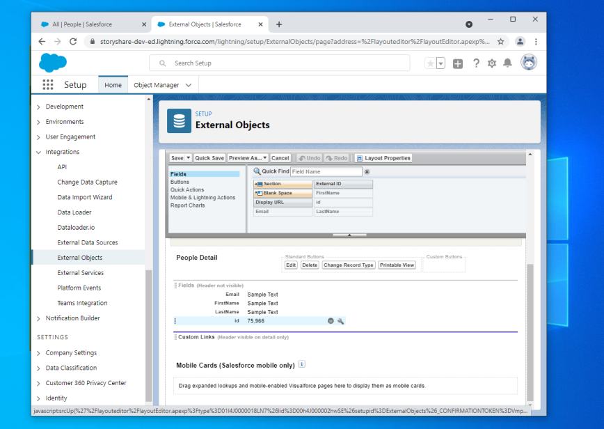

---

### Step 8 - Create a tab

The easiest way to display your data in the Lightning experience is to create a tab.
Navigate to User Interface -> Tabs, and create a new Custom Object Tab.

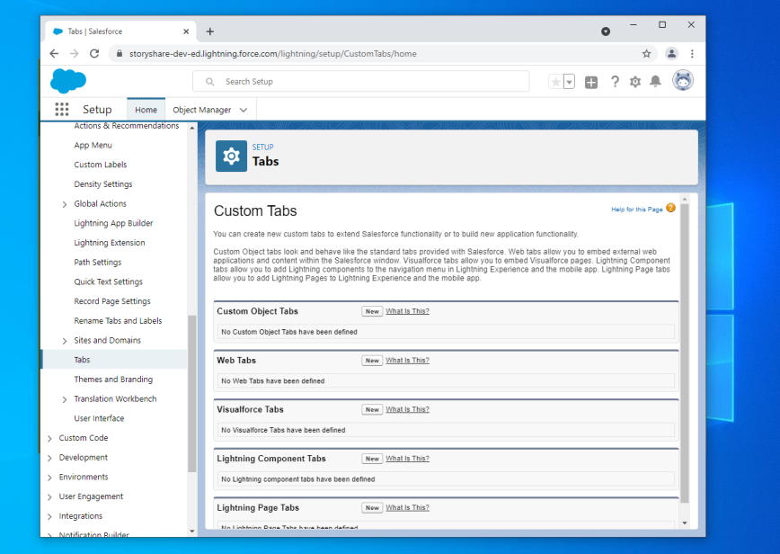

---

### Step 9 - Configure the tab

Choose your custom object from the list and choose a tab style. Click "Next" through the rest of the wizard to use
the defaults.

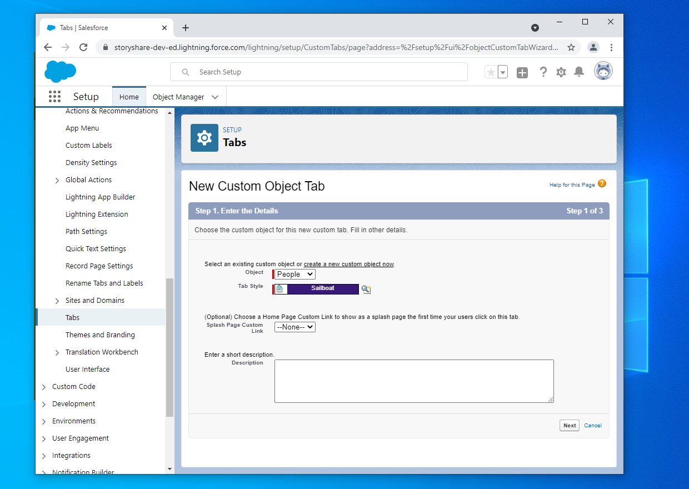

## View in Lightning

Now that the tab has been created in the Setup application, it can be viewed in the Lightning experience.

### Step 1 - Open the tab

Your new tab will be available under the More menu.


---

### Step 2 - Basic data view

Change "Recently Viewed" to "All" to show your data. By default, Salesforce is showing the "External ID", which is
the Entity ID, and the "Display URL" which is not relevant to our data. This can be easily changed.


---

### Step 3 - Change list view

Select "Select Fields to Display" from the List View Controls.


---

### Step 4 - Choose fields

Choose the fields you want to display in the list view, and remove the Display URL.


---

### Step 5 - Updated list view

Observe that the list view now looks much more presentable.

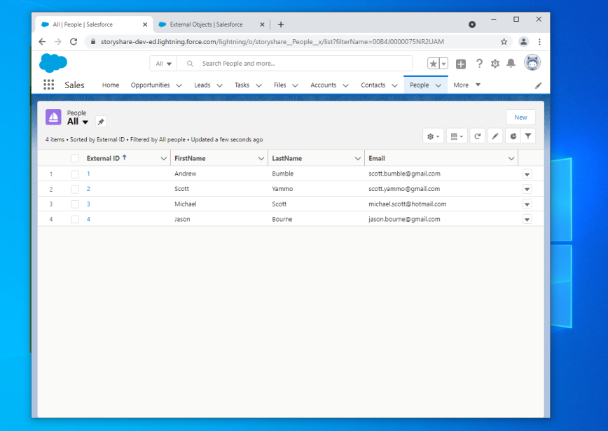

---

### Step 6 - Sorting

By clicking the field headings you can sort the columns. This is performing server-side sorting in real time.

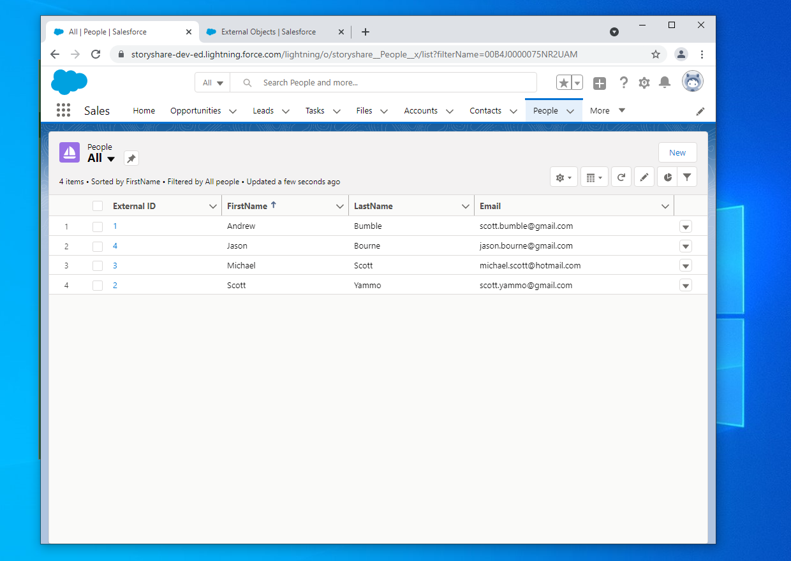

---

### Step 7 - Editing

If you configured your Lodata connection to use "Writable External Objects", then you can edit your data through this
interface. Choose a field to edit, and change its value.

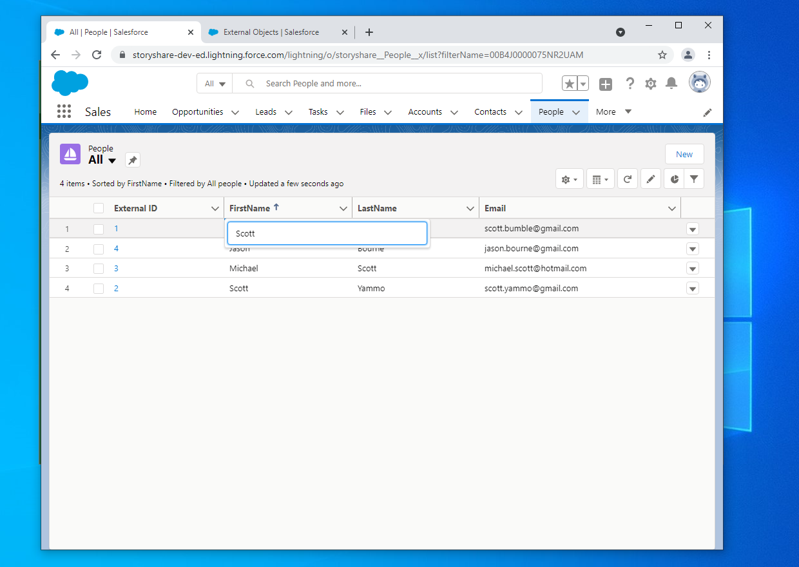

---

### Step 8 - Saving

When you click Save, your edits will be applied immediately to the service.


---

### Step 9 - Searching

If you have configured properties of your Entity Type to support searching, then you can search your Lodata models
from the main Salesforce search bar. Performing a search will use the `$search` system query option, returning
your data alongside the standard Salesforce search results.


