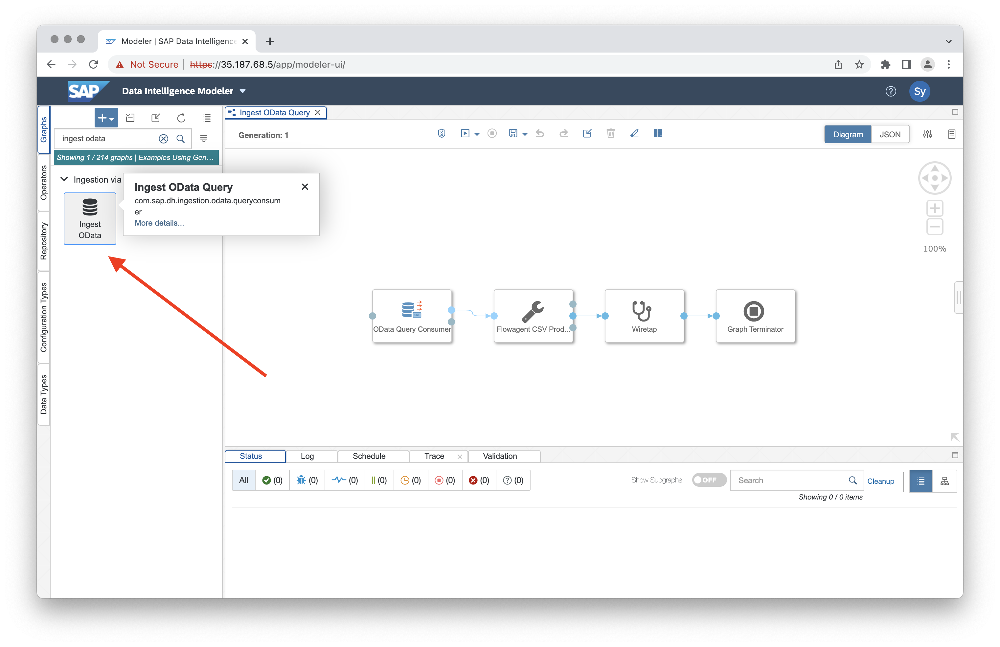
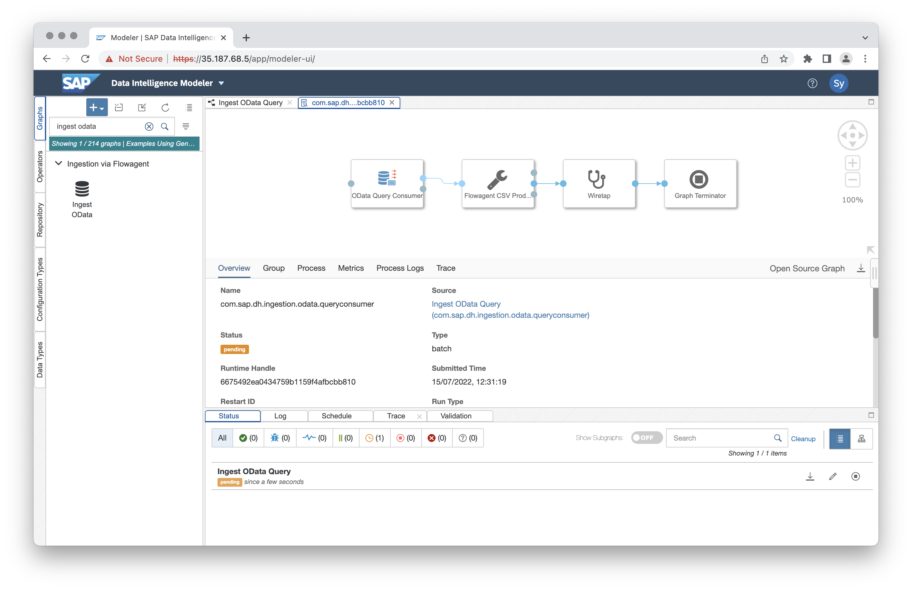

# SAP Data Intelligence

[SAP Data Intelligence](https://www.sap.com/products/data-intelligence.html)
is a comprehensive data management solution.
As the data orchestration layer of SAP Business Technology Platform, it transforms distributed
data sprawls into vital data insights, supporting innovation and business growth.

SAP DI can use Lodata as a data source, supporting data reads by searching and filtering, and
piping this data into ETL flows.

### Step 1 - Create a new graph

The easiest way to get started is to use the example graph "Ingest OData Query".

---

### Step 2 - Modify the OData Query Consumer

Click the "OData Query Consumer" configuration handle, and then edit the "OData Connection".

---

### Step 3 - Add the OData connection parameters

Ensure the "Version" is set to "V4". The URL should be the OData service root, and in this
example the service is not using authentication.

---

### Step 4 - Update the query parameter

Set the "Query" to the path you want to import. In this example we are importing the "People"
entity set. You can add filter and search parameters here.

---

### Step 5 - Execute the graph

Save and run the graph. The progress will be displayed in the console.

---

### Step 6 - Review the logs

This example graph requests and imports the data, with logging to show it has been successful.
By selecting the Trace tab and clicking Get Latest Logs, you can validate that rows from the
entity set were fetched correctly.

